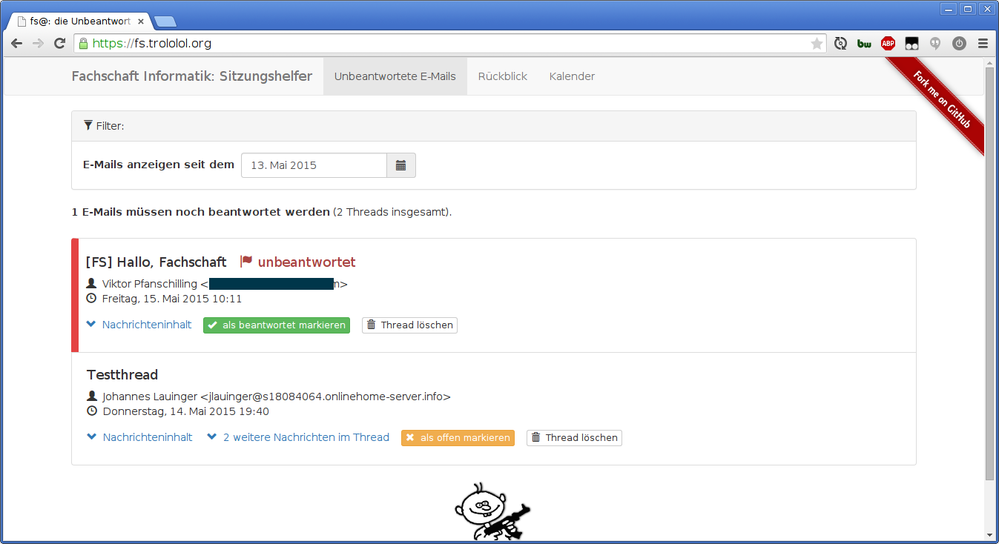

# Sitzungshelfer

Als ständiger Tagesordnungspunkt werden auf jeder Fachschaftssitzung E-Mails besprochen, die noch unbeantwortet sind. Da es bei vielen Mails im Posteingang etwas unübersichtlich werden kann, herauszufinden, welche E-Mails schon beantwortet wurden und welche noch eine Antwort benötigen, dauert dies meist unnötig lange.

FsListBot ist eine Node JS-Applikation, die E-Mails an die Liste erhält. Eine entsprechende E-Mail-Adresse steht dafür auf dem Verteiler. Die Mails werden anschließend automatisiert verarbeitet und in einer Datenbank gespeichert. Dabei werden sie in Threads gruppiert. So kann auf der Webseite eine Übersicht über die eingegangenen Vorgänge angezeigt werden. Falls im Thread eine Mail eingeht, die an den Absender der ursprünglichen Mail addressiert ist, wird der Thread als beantwortet markiert. Für E-Mails, die keine Antwort benötigen (interne Diskussionen, etc.) kann man den Thread auch manuell als beantwortet markieren.

Zu Beginn der Sitzung ist es damit nur noch nötig, die Webseite aufzurufen und die Mails, die hervorgehoben und an den Anfang sortiert wurden, zu besprechen und anschließend zu beantworten.

Neben den E-Mails bietet der Sitzungshelfer auch direkt Zugriff auf das letzte Protokoll, welches für den Rückblick auf die letzte Sitzung benötigt wird, sowie den Fachschaftskalender zum Bekanntmachen und Eintragen von neuen Terminen.

:sparkles: Automate all the things! :sparkles:

## Screenshot



## Deployment

Als eigene Prozesse:

```bash
node fslistbot.js
sudo ssh -L 0.0.0.0:25:localhost:3001 -i /root/.ssh/id_rsa root@localhost -N
```

Einen Webserver nach Wahl als Proxy konfigurieren, z.B. Apache:

```
ProxyPass / http://localhost:3000/
ProxyPassReverse / http://localhost:3000/
```

## Lizenz

GPL Version 2 (in diesem Repository enthalten)

Copyright (C) 2015 Johannes Lauinger
